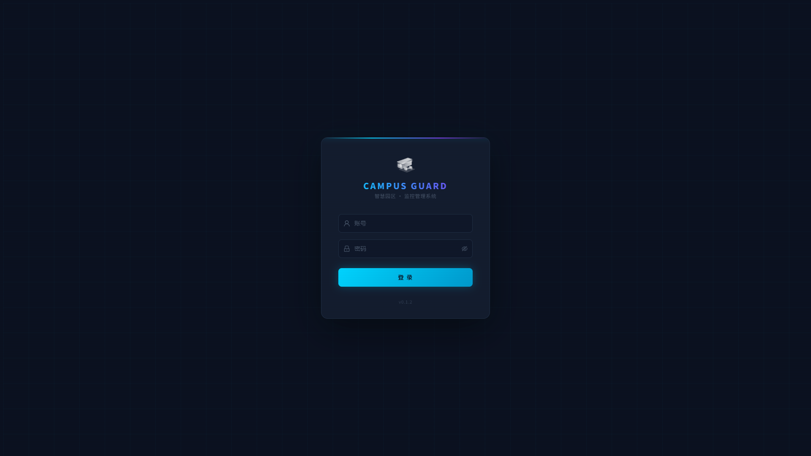
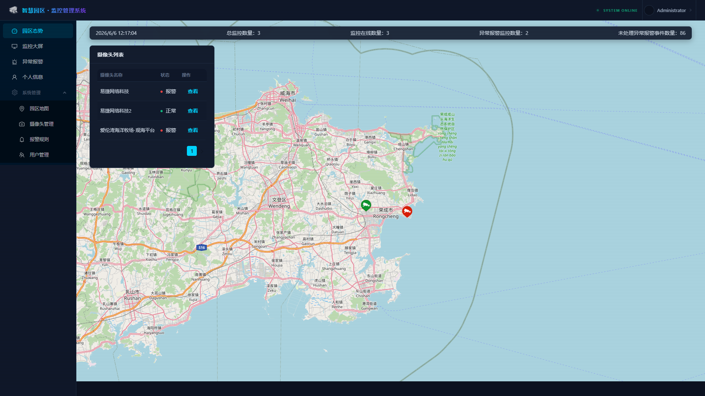
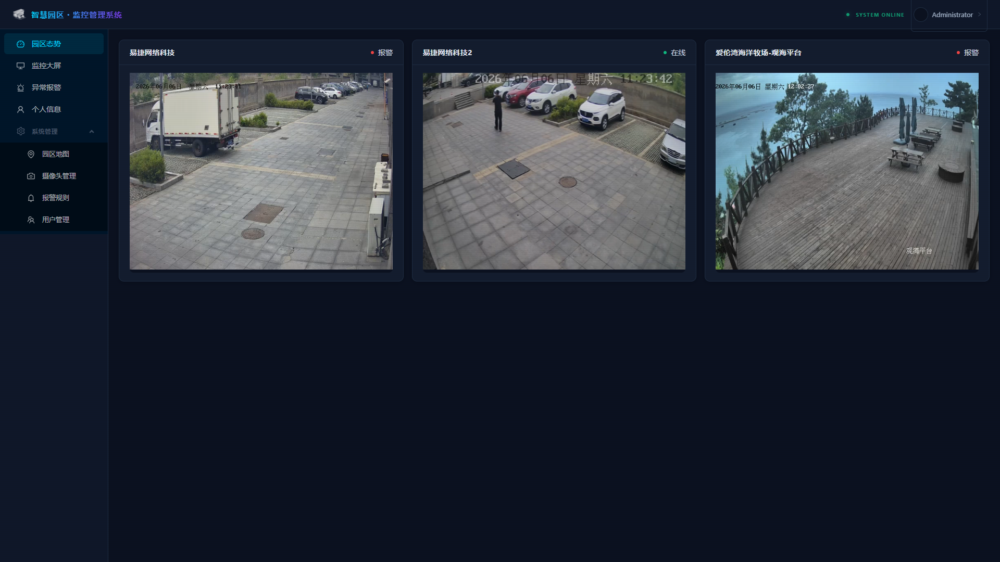
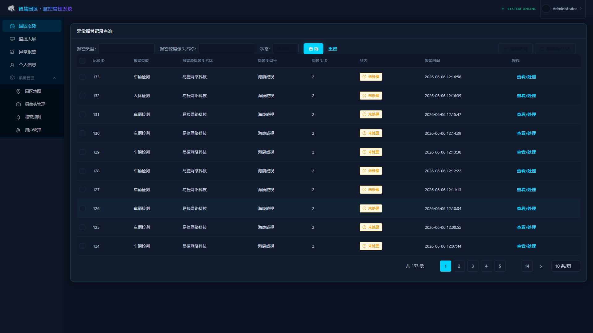
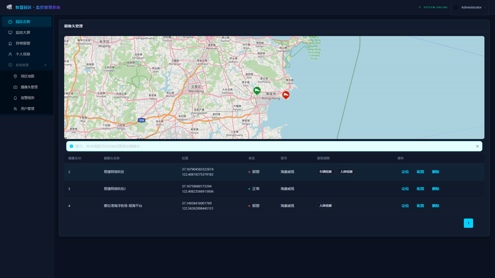
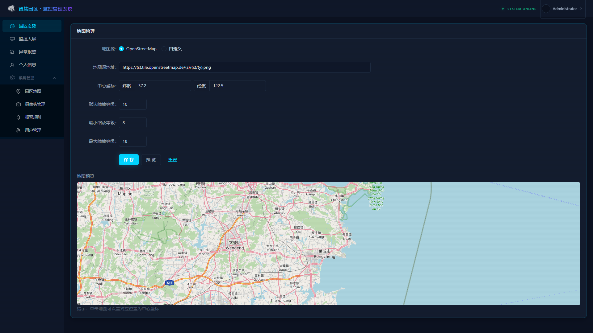
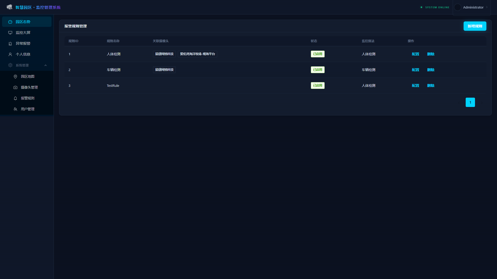
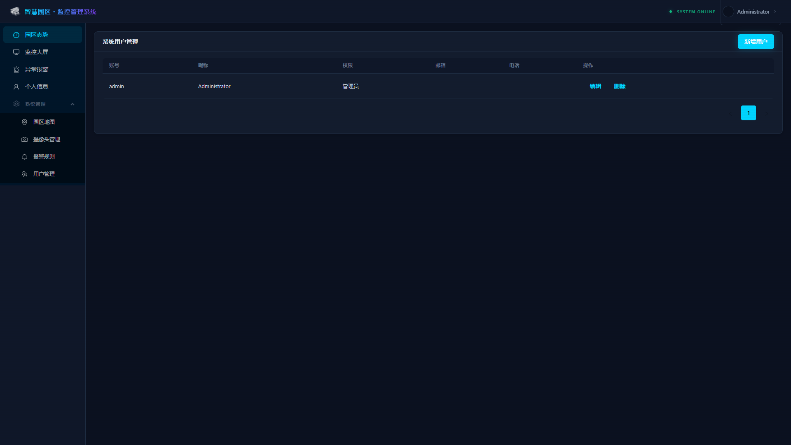

<div align="center">

# 智慧园区视频监控系统

**基于 GIS 地图、HLS 低延迟直播和 YOLOv8 深度学习的智能园区视频监控 Web 系统**

[](https://docs.docker.com/compose/)
[](https://python.org)
[](https://nestjs.com)
[](https://react.dev)
[](https://ant.design)
[](https://ultralytics.com)
[](LICENSE)

[功能特性](#功能特性) · [快速开始](#快速开始) · [系统架构](#系统架构) · [配置说明](#配置说明) · [API 文档](#api-端点)

</div>

---

## 简介

传统园区视频监控系统不存储园区 GIS 地图，也没有精确记录摄像头的地理位置和相对位置关系，不便于监控调取和管理。同时，传统系统还需人工值守监视画面并研判上报事件，限制了易用性、实时性和效率。

本系统通过**服务器本地地图**、**HLS 低延迟直播**和 **YOLOv8 深度学习检测**，实现：园区自定义地图的本地存储与渲染、多摄像头实时直播（HLS 协议秒级延迟）、基于地理位置的摄像头管理、AI 实时目标检测与自动报警、报警触发规则自定义，以及角色权限管理。

## 功能截图

| 登录页 | 园区态势 |
|:---:|:---:|
|  |  |

| 监控大屏 | 异常报警 |
|:---:|:---:|
|  |  |

| 摄像头管理 | 地图管理 |
|:---:|:---:|
|  |  |

| 报警规则 | 用户管理 |
|:---:|:---:|
|  |  |

---

## 快速开始

### 前置要求

服务器只需安装 [Docker](https://docs.docker.com/get-docker/) 和 Docker Compose v2+，至少 2GB 可用磁盘空间，并确保网络可访问摄像头的 RTSP 视频流。

### 一键部署

```bash
git clone https://github.com/290008282/campus-surveillance-system.git
cd campus-surveillance-system

# 复制并编辑环境变量（可选）
cp .env.example .env

# 构建并启动所有服务
docker compose up -d --build
```

> **中国大陆服务器加速：** 编辑 `.env` 文件，取消 `USE_CN_MIRROR` 相关行的注释即可启用阿里云镜像加速。

### 访问系统

部署完成后，打开浏览器访问 `http://<服务器IP>:8088`，使用默认账号 `admin` / `admin` 登录。首次登录后建议立即修改密码。

---

## 系统架构

```
┌─────────────┐     ┌──────────────────┐     ┌──────────────┐
│   Frontend   │────▶│   Backend (Nest) │────▶│    MySQL     │
│  UmiJS+React │     │   HTTP + WS      │     │    8.0       │
└─────────────┘     └────────┬─────────┘     └──────────────┘
       ▲                     │
       │                     │ WebSocket
       │                     ▼
       │              ┌──────────────┐
       │              │    AI End    │
       │              │ Python+YOLOv8│
       │              └──────┬───────┘
       │                     │ FFmpeg
       │                     ▼
       │              ┌──────────────┐
       └──────────────│  nginx-rtmp  │
         HLS Stream   │ RTMP → HLS   │
                      └──────────────┘
```

系统由三个核心容器组成。**前端**（UmiJS + React + Ant Design 5）负责管理界面、Leaflet 地图渲染和 HLS 直播播放。**后端**（NestJS + TypeORM + Socket.IO）提供 REST API、WebSocket 实时通信和数据库操作。**AI 端**（Python + YOLOv8n + FFmpeg）负责 RTSP 转 RTMP 推流和目标检测报警上报。**nginx-rtmp** 集成在 front-backend 容器中，完成 RTMP 到 HLS 的切片分发。

### 组件说明

| 组件 | 技术栈 | 说明 |
|------|--------|------|
| **前端** | UmiJS 4 + React 18 + Ant Design 5 + Leaflet + hls.js | Web 管理界面、GIS 地图、直播播放 |
| **后端** | NestJS 9 + TypeORM + Socket.IO | REST API、WebSocket、JWT 认证 |
| **AI 端** | Python 3.10 + YOLOv8n + FFmpeg | 目标检测、RTSP→RTMP 推流、报警上报 |
| **媒体服务** | nginx + libnginx-mod-rtmp | RTMP 收流、HLS 切片分发 |
| **数据库** | MySQL 8.0 | 用户、摄像头、报警事件等数据存储 |

---

## 配置说明

所有配置通过环境变量管理，参考 `.env.example` 文件。

### 核心配置

| 变量 | 默认值 | 说明 |
|------|--------|------|
| `WEB_PORT` | `8088` | Web 界面访问端口 |
| `API_PORT` | `3000` | 后端 API 端口 |
| `RTMP_PORT` | `1515` | RTMP 推流端口 |
| `JWT_SECRET` | `campus-secret-key-...` | JWT 签名密钥（生产环境务必修改） |
| `HMAC_KEY` | Base64 编码密钥 | HMAC-SHA256 认证密钥 |
| `ADMIN_USERNAME` | `admin` | AI 端通信使用的管理员账号 |
| `ADMIN_PASSWORD` | `admin` | AI 端通信使用的管理员密码（首次登录后修改） |

### AI 端配置

| 变量 | 默认值 | 说明 |
|------|--------|------|
| `DETECTION_INTERVAL` | `0.5` | 检测间隔（秒），弱 CPU 建议设为 10-15 |
| `MODEL_DEVICE` | `cpu` | 推理设备，支持 `cpu` 或 `cuda` |

### 中国大陆镜像加速

| 变量 | 默认值 | 说明 |
|------|--------|------|
| `USE_CN_MIRROR` | `false` | 启用阿里云 apt/pip/npm 镜像 |
| `NPM_REGISTRY` | `https://registry.npmjs.org` | npm 镜像源 |
| `PIP_INDEX_URL` | `https://pypi.org/simple/` | pip 镜像源 |

---

## API 端点

### 用户认证

| 方法 | 路径 | 说明 |
|------|------|------|
| POST | `/api/user/login` | 用户登录（HMAC-SHA256 密码签名） |

### 摄像头管理

| 方法 | 路径 | 说明 |
|------|------|------|
| GET | `/api/user/getCameraInfo` | 获取摄像头信息 |
| GET | `/api/ai/getAllCameraList` | 获取所有摄像头列表 |
| GET | `/api/ai/getOfflineCameraList` | 获取离线摄像头列表 |

### AI 端通信

AI 端通过 WebSocket (`/ws/ai/socket.io`) 与后端实时通信，包括摄像头列表同步（每 60 秒）、进程存活检查（每 30 秒）、异常事件实时上报，以及报警去重（节流 300 秒）。

---

## 项目结构

```
campus-surveillance-system/
├── docker-compose.yml          # 三容器服务编排
├── front-backend.Dockerfile    # 前端 + 后端 + nginx-rtmp 镜像
├── ai-end.Dockerfile           # Python AI 检测端镜像
├── init.sql                    # 数据库初始化脚本
├── .env.example                # 环境变量模板
├── backend/
│   ├── nginx.conf              # nginx + RTMP + HLS 配置
│   └── src/
│       ├── controllers/        # REST API 控制器
│       ├── services/           # 业务逻辑（camera/user/alarm）
│       └── ws-gateways/       # WebSocket 网关
├── frontend/
│   ├── .umirc.ts               # UmiJS + Ant Design 主题配置
│   └── src/
│       ├── layouts/            # 全局布局（Header/Sider/Content）
│       ├── pages/              # 各功能页面
│       └── components/         # 公共组件（HLS 播放器等）
├── ai-end/
│   ├── main.py                 # FFmpeg 推流 + YOLOv8 检测调度
│   ├── model.py                # YOLOModel 封装
│   ├── wsClient.py             # WebSocket 客户端
│   └── requirements.txt        # Python 依赖
└── docs/                       # 文档截图
```

---

## v0.2.0 更新日志

**UI 全面升级** — 全新深色科技风格界面，cyan 主色调搭配深色背景，动画网格背景、发光效果、渐变品牌标识，提升监控系统的专业感和视觉体验。

**AI 性能优化** — 针对低功耗 CPU（如 Celeron J1900）深度优化：YOLO 推理尺寸降至 320px、帧预缩放、检测间隔智能控制，CPU 占用从 200% 降至 70% 以下。

**视频质量提升** — 修复 H.264 Level 3.0 分辨率限制导致的画面模糊问题，升级至 Level 3.1 实现 640x480@15fps 全分辨率输出，码率提升至 800kbps。

**报警检测修复** — 修正 YOLO API 调用方式（`model.predict` → `detectImage`），确保人体和车辆目标检测正常工作。

**认证安全加固** — 修复 JWT 认证缓存问题、HMAC 双重签名 Bug、AI 端 WebSocket 认证流程。

**全球部署支持** — Dockerfile 镜像源改为可选参数，通过 `USE_CN_MIRROR` 环境变量控制，支持全球任意服务器一键部署。

---

## 常见问题

**宿主机 80 端口被占用：** 通过 `WEB_PORT` 环境变量映射到其他端口（默认已使用 8088）。

**HLS 流 404 错误：** 确保 nginx 配置中 `location /hls/` 的 `alias` 路径以 `/` 结尾。

**/dev/shm 空间不足：** docker-compose.yml 已为 front-backend 容器配置 `shm_size: '1g'`。

**弱 CPU 设备卡顿：** 将 `DETECTION_INTERVAL` 设为 10-15 秒，AI 端会自动优化推理频率。

---

## 致谢

本项目 Fork 自 [CrazyHer/campus-surveillance-system](https://github.com/CrazyHer/campus-surveillance-system)，基于 MIT 协议开源。

## 许可证

[MIT License](LICENSE)
